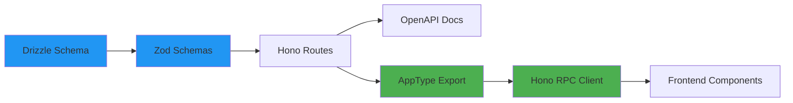

# Hono RPC Type-Safe API Client

## Overview

Hono RPC provides **zero-codegen, end-to-end type safety** between your Hono API and frontend applications. By sharing API types, you get automatic TypeScript inference for all routes, parameters, request bodies, and responses—without any code generation step.

## Current State vs. Hono RPC

### What You Have Now (Manual)

**`apps/web/app/lib/api.client.ts`:**
```typescript
// ❌ Manual type definitions - prone to drift
export async function getTasks() {
  return apiRequest<Array<{ id: number; name: string; done: boolean }>>(
    '/tasks'
  );
}

// ❌ Repeated for every endpoint
export async function createTask(data: { name: string; done?: boolean }) {
  return apiRequest<{ id: number; name: string; done: boolean }>('/tasks', {
    method: 'POST',
    body: JSON.stringify(data),
  });
}
```

**Problems:**
- ❌ Types are manually duplicated from API
- ❌ No compile-time validation if API changes
- ❌ No autocomplete for request/response shapes
- ❌ Must manually update multiple places when API changes
- ❌ Type drift between API and client

### What You Get With Hono RPC

**`apps/web/app/lib/api.client.ts`:**
```typescript
// ✅ Single import, all types inferred automatically
import { hc } from 'hono/client';
import type { AppType } from '../../../../apps/api/src/app';

const client = hc<AppType>(import.meta.env.VITE_API_URL || 'http://localhost:9999');

// ✅ Fully typed with autocomplete
const res = await client.tasks.$get();
const tasks = await res.json(); // ✅ Type: Task[]

// ✅ TypeScript enforces correct request body
const newTask = await client.tasks.$post({
  json: {
    name: 'Buy groceries', // ✅ Autocomplete available
    done: false, // ✅ Required by your schema
  }
});
```

**Benefits:**
- ✅ **Zero codegen** - Pure TypeScript type inference
- ✅ **Single source of truth** - Types come directly from API
- ✅ **Compile-time safety** - TypeScript catches API changes immediately
- ✅ **Full autocomplete** - All routes, params, bodies, responses
- ✅ **Instant refactoring** - Rename in API, TypeScript shows all usages
- ✅ **Works with OpenAPI** - Keep your OpenAPI docs and Zod validation

## How It Works

### Architecture Flow



### 1. API Type Export

Your API routes are already defined with Zod schemas:

**`apps/api/src/routes/tasks/tasks.routes.ts`:**
```typescript
export const list = createRoute({
  path: "/tasks",
  method: "get",
  responses: {
    [HttpStatusCodes.OK]: jsonContent(
      z.array(selectTasksSchema),
      "The list of tasks",
    ),
  },
});

export type ListRoute = typeof list;
```

**`apps/api/src/app.ts` (Current):**
```typescript
const routes = [index, tasks] as const;

routes.forEach((route) => {
  app.route("/", route);
});

// ❌ Current: Exports individual route types
export type AppType = typeof routes[number];
```

**`apps/api/src/app.ts` (Updated for RPC):**
```typescript
const routes = [index, tasks] as const;

const apiRoutes = routes.reduce((app, route) => {
  return app.route("/", route);
}, new Hono());

// ✅ Export the full app type for RPC
export type AppType = typeof apiRoutes;

export default app;
```

### 2. Frontend Client Setup

**`apps/web/app/lib/api.client.ts`:**
```typescript
import { hc } from 'hono/client';
import type { AppType } from '../../../../apps/api/src/app';

// Create typed client
export const api = hc<AppType>(
  import.meta.env.VITE_API_URL || 'http://localhost:9999'
);

// Type helper for inferring types
export type ApiClient = typeof api;
```

**With credentials (for cookies):**
```typescript
export const api = hc<AppType>(
  import.meta.env.VITE_API_URL || 'http://localhost:9999',
  {
    init: {
      credentials: 'include', // Include cookies with requests
    },
  }
);
```

### 3. Usage in Components

**`apps/web/app/routes/tasks.tsx`:**
```typescript
import { api } from '~/lib/api.client';

export async function loader() {
  // ✅ Fully typed, autocomplete for all routes
  const res = await api.tasks.$get();
  
  // ✅ Type-safe response parsing
  if (!res.ok) {
    throw new Error('Failed to fetch tasks');
  }
  
  const tasks = await res.json(); // ✅ Type: Task[]
  return { tasks };
}

export default function TasksRoute() {
  const { tasks } = useLoaderData<typeof loader>();
  
  const handleCreate = async (name: string) => {
    // ✅ TypeScript enforces correct body shape
    const res = await api.tasks.$post({
      json: {
        name, // ✅ Required
        done: false, // ✅ Required by your schema
      }
    });
    
    if (res.ok) {
      const task = await res.json(); // ✅ Type: Task
      console.log(task.id); // ✅ Autocomplete works
    }
  };
  
  // ... rest of component
}
```

## API Methods

### GET Requests

```typescript
// List all tasks
const res = await api.tasks.$get();
if (res.ok) {
  const tasks = await res.json(); // Type: Task[]
}

// Get single task with path parameter
const res = await api.tasks[':id'].$get({
  param: { id: '123' } // Must be string
});

if (res.ok) {
  const task = await res.json(); // Type: Task
}
```

### POST Requests

```typescript
const res = await api.tasks.$post({
  json: {
    name: 'New task',
    done: false,
  }
});

if (res.ok) {
  const task = await res.json(); // Type: Task
}
```

### PATCH Requests

```typescript
const res = await api.tasks[':id'].$patch({
  param: { id: '123' }, // Path parameter
  json: {
    done: true, // Partial update
  }
});

if (res.ok) {
  const updated = await res.json(); // Type: Task
}
```

### DELETE Requests

```typescript
const res = await api.tasks[':id'].$delete({
  param: { id: '123' }
});

// For 204 No Content responses
if (res.ok) {
  // Success, no body to parse
}
```

## Path Parameters

Path parameters **must** be passed as strings, even if the underlying type is different (e.g., numbers).

```typescript
// ✅ Correct - string
const res = await api.tasks[':id'].$get({
  param: { id: '123' }
});

// ❌ Wrong - number
const res = await api.tasks[':id'].$get({
  param: { id: 123 } // TypeScript error
});
```

### Including Slashes in Parameters

Hono RPC doesn't URL-encode param values. To handle slashes, use regex in your route:

```typescript
// Server route
const route = app.get(
  '/files/:path{.+}', // Regex to match slashes
  zValidator(
    'param',
    z.object({
      path: z.string(),
    })
  ),
  (c) => {
    const { path } = c.req.valid('param'); // path: "folder/file.txt"
    // ...
  }
)

// Client usage
const res = await client.files[':path'].$get({
  param: { path: 'folder/file.txt' } // Slashes preserved
});
```

## Query Parameters

When you add query parameters to routes:

```typescript
// API route
export const list = createRoute({
  path: "/tasks",
  method: "get",
  request: {
    query: z.object({
      done: z.boolean().optional(),
      limit: z.coerce.number().optional(), // Coerce string to number
    }),
  },
  responses: {
    [HttpStatusCodes.OK]: jsonContent(
      z.array(selectTasksSchema),
      "Filtered tasks",
    ),
  },
});

// Client usage - fully typed!
const res = await api.tasks.$get({
  query: {
    done: 'true', // Must be string, validator coerces to boolean
    limit: '10', // Must be string, validator coerces to number
  }
});
```

## Status Code Handling

When you specify status codes explicitly in `c.json()`, they're added to the client type:

**API with status codes:**
```typescript
export const getOne: AppRouteHandler<GetOneRoute> = async (c) => {
  const { id } = c.req.valid("param");
  const task = await db.query.tasks.findFirst({
    where(fields, operators) {
      return operators.eq(fields.id, id);
    },
  });

  if (!task) {
    return c.json(
      { message: HttpStatusPhrases.NOT_FOUND },
      404 // ✅ Explicit status code
    );
  }

  return c.json(task, 200); // ✅ Explicit status code
};
```

**Client with type-safe status handling:**
```typescript
const res = await api.tasks[':id'].$get({
  param: { id: '123' }
});

// ✅ Type narrowing by status code
if (res.status === 404) {
  const error = await res.json(); // Type: { message: string }
  console.log(error.message);
}

if (res.ok) {
  const task = await res.json(); // Type: Task
  console.log(task.name);
}

// Infer response type by status code
import type { InferResponseType } from 'hono/client';

type AllResponses = InferResponseType<typeof api.tasks[':id'].$get>;
// Type: Task | { message: string }

type SuccessResponse = InferResponseType<typeof api.tasks[':id'].$get, 200>;
// Type: Task

type ErrorResponse = InferResponseType<typeof api.tasks[':id'].$get, 404>;
// Type: { message: string }
```

## Error Handling

### ⚠️ Don't Use `c.notFound()`

**Avoid this:**
```typescript
// ❌ Client can't infer the response type
if (!task) {
  return c.notFound();
}
```

**Use this instead:**
```typescript
// ✅ Client can infer { message: string } for 404
if (!task) {
  return c.json(
    { message: HttpStatusPhrases.NOT_FOUND },
    404
  );
}
```

### Handling Errors

```typescript
const res = await api.tasks[':id'].$get({
  param: { id: '123' }
});

if (!res.ok) {
  if (res.status === 404) {
    const error = await res.json(); // Type: { message: string }
    console.error('Not found:', error.message);
  } else if (res.status === 422) {
    const error = await res.json(); // Type: ZodError from your schema
    console.error('Validation errors:', error.issues);
  } else {
    throw new Error(`API error: ${res.status}`);
  }
}

const task = await res.json(); // Type: Task
```

### Using `parseResponse` Helper

```typescript
import { parseResponse, DetailedError } from 'hono/client';

try {
  // Automatically throws if !res.ok
  const task = await parseResponse(
    api.tasks[':id'].$get({ param: { id: '123' } })
  );
  // task is already parsed based on Content-Type
  console.log(task.name);
} catch (e: unknown) {
  if (e instanceof DetailedError) {
    console.error('Status:', e.response.status);
    console.error('Body:', e.body);
  }
}
```

## Headers

### Per-Request Headers

```typescript
const res = await api.tasks.$get(
  {},
  {
    headers: {
      'X-Custom-Header': 'Value',
      'X-User-Agent': 'My App',
    },
  }
);
```

### Global Headers

```typescript
// Common headers for all requests
const api = hc<AppType>('http://localhost:9999', {
  headers: {
    Authorization: `Bearer ${token}`,
  },
});
```

## Custom Fetch and Init Options

### Aborting Requests

```typescript
const abortController = new AbortController();

const res = await api.tasks.$get(
  {},
  {
    init: {
      signal: abortController.signal,
    },
  }
);

// Later...
abortController.abort();
```

### Custom Fetch Method

Useful for Service Bindings, proxies, etc:

```typescript
// Using Cloudflare Service Bindings
const api = hc<AppType>('http://localhost', {
  fetch: c.env.AUTH.fetch.bind(c.env.AUTH),
});
```

## Getting URLs

Use `$url()` to get a URL object without making the request:

```typescript
// ⚠️ Must provide absolute URL for $url() to work
const api = hc<AppType>('http://localhost:9999'); // ✅ Absolute URL

let url = api.tasks.$url();
console.log(url.pathname); // "/tasks"

url = api.tasks[':id'].$url({
  param: { id: '123' }
});
console.log(url.pathname); // "/tasks/123"
console.log(url.href); // "http://localhost:9999/tasks/123"
```

## File Uploads

```typescript
// Client
const res = await api.upload.$post({
  form: {
    file: new File([fileToUpload], filename, {
      type: fileToUpload.type,
    }),
    description: 'My file',
  }
});

// Server route
const route = app.post(
  '/upload',
  zValidator(
    'form',
    z.object({
      file: z.instanceof(File),
      description: z.string(),
    })
  ),
  async (c) => {
    const { file, description } = c.req.valid('form');
    // Process file...
    return c.json({ success: true });
  }
);
```

## Type Inference Helpers

### InferRequestType

```typescript
import type { InferRequestType } from 'hono/client';

const $post = api.tasks.$post;

// Get the request type
type ReqType = InferRequestType<typeof $post>['json'];
// Type: { name: string; done: boolean }

// Use in function signatures
async function createTask(data: ReqType) {
  const res = await $post({ json: data });
  return res.json();
}
```

### InferResponseType

```typescript
import type { InferResponseType } from 'hono/client';

// All possible response types
type AllResponses = InferResponseType<typeof api.tasks[':id'].$get>;
// Type: Task | { message: string }

// Specific status code
type SuccessResponse = InferResponseType<typeof api.tasks[':id'].$get, 200>;
// Type: Task
```

## Using with React Hooks (SWR)

```tsx
import useSWR from 'swr';
import { hc } from 'hono/client';
import type { InferRequestType } from 'hono/client';
import type { AppType } from '../../../../apps/api/src/app';

const App = () => {
  const client = hc<AppType>('http://localhost:9999');
  const $get = client.tasks.$get;

  const fetcher = (arg: InferRequestType<typeof $get>) => async () => {
    const res = await $get(arg);
    return await res.json();
  };

  const { data, error, isLoading } = useSWR(
    'tasks',
    fetcher({
      query: {
        done: 'true',
      },
    })
  );

  if (error) return <div>Failed to load</div>;
  if (isLoading) return <div>Loading...</div>;

  return (
    <ul>
      {data?.map(task => (
        <li key={task.id}>{task.name}</li>
      ))}
    </ul>
  );
};
```

## Implementation Steps

### Step 1: Update API Type Export

**File: `apps/api/src/app.ts`**

```typescript
import configureOpenAPI from "@/lib/configure-open-api";
import createApp from "@/lib/create-app";
import index from "@/routes/index.route";
import tasks from "@/routes/tasks/tasks.index";

const app = createApp();

configureOpenAPI(app);

const routes = [index, tasks] as const;

// Combine routes into a single typed app
const apiRoutes = routes.reduce((acc, route) => {
  return acc.route("/", route);
}, app);

// ✅ Export the full app type for RPC
export type AppType = typeof apiRoutes;

export default app;
```

### Step 2: Install Hono Client (if needed)

The `hono` package already includes the client:

```bash
cd apps/web
pnpm list hono
# Should already be installed as part of your dependencies
```

### Step 3: Replace Manual Client

**File: `apps/web/app/lib/api.client.ts`**

```typescript
import { hc } from 'hono/client';
import type { AppType } from '../../../../apps/api/src/app';

// Create the typed client
export const api = hc<AppType>(
  import.meta.env.VITE_API_URL || 'http://localhost:9999'
);
```

### Step 4: Update Server-Side Client

**File: `apps/web/app/lib/api.server.ts`**

```typescript
import { hc } from 'hono/client';
import type { AppType } from '../../../../apps/api/src/app';

const API_BASE_URL = process.env.API_URL || 'http://localhost:9999';

export const api = hc<AppType>(API_BASE_URL);
```

### Step 5: Migrate Route Loaders

**Before:**
```typescript
import { getTasks } from '~/lib/api.client';

export async function loader() {
  const tasks = await getTasks();
  return { tasks };
}
```

**After:**
```typescript
import { api } from '~/lib/api.client';

export async function loader() {
  const res = await api.tasks.$get();
  
  if (!res.ok) {
    throw new Response('Failed to fetch tasks', { status: res.status });
  }
  
  const tasks = await res.json();
  return { tasks };
}
```

## Performance Optimization

### For Larger Applications

#### 1. Compile Types Before Using (Recommended)

Create a pre-compiled client to avoid type instantiation overhead:

**`apps/web/app/lib/api-compiled.ts`:**
```typescript
import { app } from '../../../../apps/api/src/app';
import { hc } from 'hono/client';

// Pre-calculate the type during compilation
export type Client = ReturnType<typeof hc<typeof app>>;

export const hcWithType = (...args: Parameters<typeof hc>): Client =>
  hc<typeof app>(...args);
```

**Usage:**
```typescript
import { hcWithType } from '~/lib/api-compiled';

const client = hcWithType('http://localhost:9999');
// Types are already calculated at compile time!
```

#### 2. Split Large Apps

For large applications, split your API into multiple smaller apps:

**`apps/api/src/routes/tasks/tasks.index.ts`:**
```typescript
export const tasksApp = new Hono()
  .get('/', list)
  .post('/', create)
  .get('/:id', getOne)
  .patch('/:id', patch)
  .delete('/:id', remove);

export type TasksAppType = typeof tasksApp;
```

**Create separate clients:**
```typescript
// tasks-client.ts
import { hc } from 'hono/client';
import type { TasksAppType } from '../../../../apps/api/src/routes/tasks/tasks.index';

export const tasksClient = hc<TasksAppType>('/tasks');
```

This prevents TypeScript from instantiating types for all routes at once.

### TypeScript Configuration

**Important:** For RPC types to work properly in a monorepo, set `"strict": true` in both client and server `tsconfig.json`:

**`apps/api/tsconfig.json` and `apps/web/tsconfig.json`:**
```json
{
  "compilerOptions": {
    "strict": true, // ✅ Required for RPC
    // ... other options
  }
}
```

## Migration Strategy

### Phase 1: Setup (No Breaking Changes)
1. ✅ Update `AppType` export in API
2. ✅ Install/verify Hono client
3. ✅ Create new RPC client alongside existing manual client
4. ✅ Test with one simple route

### Phase 2: Gradual Migration
1. ✅ Migrate `GET /tasks` loader
2. ✅ Test thoroughly
3. ✅ Migrate `POST /tasks` action
4. ✅ Test thoroughly
5. ✅ Continue with remaining routes one by one

### Phase 3: Cleanup
1. ✅ Remove old manual client functions
2. ✅ Delete unused type definitions
3. ✅ Update documentation

### Phase 4: Enhancements (Optional)
1. ✅ Add request/response interceptors
2. ✅ Implement retry logic
3. ✅ Add caching layer
4. ✅ Add optimistic updates

## Common Patterns

### Loading States in Loaders

```typescript
export async function loader() {
  try {
    const res = await api.tasks.$get();
    
    if (!res.ok) {
      throw new Response('Failed to fetch', { status: res.status });
    }
    
    const tasks = await res.json();
    return { tasks };
  } catch (error) {
    console.error('Loader error:', error);
    throw new Response('Network error', { status: 500 });
  }
}
```

### Form Actions

```typescript
export async function action({ request }: ActionFunctionArgs) {
  const formData = await request.formData();
  const name = formData.get('name') as string;
  
  const res = await api.tasks.$post({
    json: { name, done: false }
  });
  
  if (!res.ok) {
    const error = await res.json();
    return json({ error }, { status: res.status });
  }
  
  return redirect('/tasks');
}
```

### Parallel Requests

```typescript
export async function loader() {
  const [tasksRes, statsRes] = await Promise.all([
    api.tasks.$get(),
    api.stats.$get(),
  ]);
  
  if (!tasksRes.ok || !statsRes.ok) {
    throw new Response('Failed to fetch data', { status: 500 });
  }
  
  const [tasks, stats] = await Promise.all([
    tasksRes.json(),
    statsRes.json(),
  ]);
  
  return { tasks, stats };
}
```

## Benefits Over Current Approach

### 1. Type Safety

**Current (Manual):**
```typescript
// ❌ If API changes Task type, no compile error
export async function getTasks() {
  return apiRequest<Array<{ id: number; name: string; done: boolean }>>(
    '/tasks'
  );
}
```

**Hono RPC:**
```typescript
// ✅ If API changes, TypeScript errors immediately
const res = await api.tasks.$get();
const tasks = await res.json(); // Automatically has correct type
```

### 2. Developer Experience

- **Autocomplete**: VSCode shows all routes as you type
- **Documentation**: Hover to see request/response types
- **Refactoring**: Rename a route, all usages update
- **Safety**: Can't call non-existent endpoints

### 3. Maintenance

**Current:**
- Change API → Update types → Update client → Update components
- 4+ places to update, easy to miss

**Hono RPC:**
- Change API → TypeScript shows what needs updating
- Compiler enforces correctness

## Keeping OpenAPI Benefits

You **don't lose anything** by using Hono RPC:

1. ✅ OpenAPI docs (`/doc`, `/reference`) still work
2. ✅ Zod validation still active
3. ✅ External clients can use OpenAPI spec
4. ✅ Scalar UI still available
5. ✅ Can use both: RPC internally, OpenAPI for partners

## Known Issues and Solutions

### IDE Performance with Many Routes

Large apps can slow IDE performance due to type instantiation. Solutions:

1. **Compile types before using** (recommended - see Performance section)
2. **Split into multiple apps** (see Performance section)
3. **Ensure Hono version matches** between API and web app
4. **Use TypeScript project references** for monorepos

### Hono Version Mismatch

Ensure both `apps/api` and `apps/web` use the **same Hono version**:

```bash
# Check versions
cd apps/api && pnpm list hono
cd apps/web && pnpm list hono

# Should match, e.g., both on 4.10.6
```

## Troubleshooting

### Types Not Working

**Problem:** No autocomplete or type errors

**Solution:** Ensure correct `AppType` export:
```typescript
// ✅ Export the app, not individual routes
export type AppType = typeof apiRoutes;
```

### Circular Dependencies

**Problem:** Import cycle between API and web

**Solution:** Use type-only imports:
```typescript
import type { AppType } from '../../../../apps/api/src/app';
```

### Can't Find Types

**Problem:** TypeScript can't resolve API types

**Solution:** Use relative paths or configure TypeScript:
```json
{
  "compilerOptions": {
    "baseUrl": ".",
    "paths": {
      "@api/*": ["../api/src/*"]
    }
  }
}
```

## Testing

```typescript
import { describe, it, expect } from 'vitest';
import { hc } from 'hono/client';
import type { AppType } from '../src/app';

describe('Tasks API', () => {
  const client = hc<AppType>('http://localhost:9999');
  
  it('should fetch tasks', async () => {
    const res = await client.tasks.$get();
    expect(res.ok).toBe(true);
    
    const tasks = await res.json();
    expect(Array.isArray(tasks)).toBe(true);
  });
  
  it('should create task', async () => {
    const res = await client.tasks.$post({
      json: {
        name: 'Test task',
        done: false,
      }
    });
    
    expect(res.ok).toBe(true);
    const task = await res.json();
    expect(task.name).toBe('Test task');
  });
});
```

## Comparison with Alternatives

| Feature | Hono RPC | OpenAPI Codegen | tRPC | Manual |
|---------|----------|-----------------|------|--------|
| Type Safety | ✅ Full | ✅ Full | ✅ Full | ❌ Partial |
| Setup Time | ⚡ Instant | ⏱️ Medium | ⏱️ Medium | ⚡ Fast |
| Codegen Step | ❌ No | ✅ Yes | ❌ No | ❌ No |
| Monorepo Friendly | ✅ Yes | ⚠️ Maybe | ✅ Yes | ✅ Yes |
| Keep OpenAPI | ✅ Yes | ✅ Yes | ❌ No | ✅ Yes |
| Runtime Overhead | 🪶 Minimal | 📦 More | 🪶 Minimal | 🪶 Minimal |
| Refactoring | ✅ Instant | ⏱️ Regenerate | ✅ Instant | ❌ Manual |
| Learning Curve | 📚 Easy | 📚 Easy | 📚 Medium | 📚 Easy |

## Resources

- [Official Hono RPC Documentation](https://hono.dev/docs/guides/rpc)
- [Hono Client API Reference](https://hono.dev/docs/helpers/rpc)
- [Your API OpenAPI Docs](http://localhost:9999/reference)
- [Hono RPC in Monorepos Guide](https://catalins.tech/hono-rpc-in-monorepos/)

## Next Steps

1. ✅ Read this document
2. ⏸️ Decide on migration strategy
3. ⏸️ Update `AppType` export in API
4. ⏸️ Create new RPC client in web app
5. ⏸️ Migrate one route as proof of concept
6. ⏸️ Test thoroughly and validate
7. ⏸️ Migrate remaining routes
8. ⏸️ Remove old manual client
9. ⏸️ Celebrate type-safe API calls! 🎉
